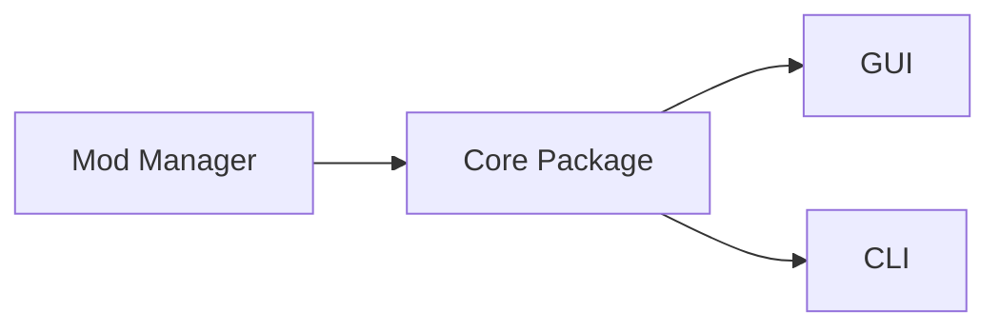
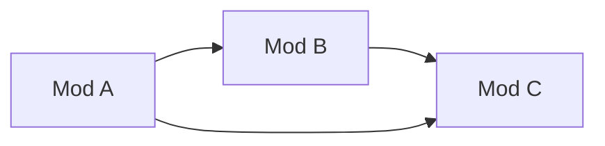

# Architecture

## Table of Contents

- [Architecture](#architecture)
  - [Table of Contents](#table-of-contents)
  - [Overview](#overview)
  - [Publishing](#publishing)
    - [Core](#core)
    - [CLI](#cli)
    - [GUI](#gui)
  - [Core Package](#core-package)
    - [Common Paths](#common-paths)
    - [Mod Installation Behavior](#mod-installation-behavior)
      - [Note about certain mods on Linux](#note-about-certain-mods-on-linux)
    - [Mod Uninstallation Behavior](#mod-uninstallation-behavior)
    - [Mod Enabling / Disabling Behavior](#mod-enabling--disabling-behavior)
      - [Note about recursive disabling](#note-about-recursive-disabling)
    - [Mod Updating / Version Checking Behavior](#mod-updating--version-checking-behavior)
      - [pathsToPreserve](#pathstopreserve)
    - [Mod Validation Behavior](#mod-validation-behavior)
    - [Mod Searching Behavior](#mod-searching-behavior)
      - [Formula](#formula)
    - [Launching Behavior](#launching-behavior)
    - [Log Server Behavior](#log-server-behavior)
    - [Alert Behavior](#alert-behavior)
    - [Analytics Behavior](#analytics-behavior)
  - [GUI Package](#gui-package)
    - [Protocol](#protocol)

## Overview

The mod manager is split up into 3 main parts:

- The Core Package - This contains shared code between the GUI and CLI
- The CLI - This is the command line interface to the mod manager
- The GUI - This is the graphical user interface to the mod manager

There also is `xtask` which is used internally for simple scripts.

## Publishing

Versions of the manager are published to the following sources

### Core

- [crates.io](https://crates.io/crates/owmods_core)
- GitHub Releases
  - .crate

### CLI

- [crates.io](https://crates.io/crates/owmods_cli)
- GitHub Releases
  - .deb
  - .tar.gz
  - .exe
- [AUR](https://aur.archlinux.org/packages/owmods-cli-bin/)
- [NixOS flake](https://github.com/loco-choco/ow-mod-man-flake)

### GUI

- GitHub releases
  - .deb
  - .tar.gz
  - .AppImage
  - .msi (Wix)
  - .exe (NSIS)
- [AUR](https://aur.archlinux.org/packages/owmods-gui-bin/)
- [NixOS flake](https://github.com/loco-choco/ow-mod-man-flake)
- [Flathub](https://flathub.org/apps/com.outerwildsmods.owmods_gui)

## Core Package

The core package contains shared code between the GUI and CLI.

It has a lot of stuff in it, basically everything that isn't GUI or CLI specific.

### Common Paths

(All these are in terms of Linux paths, on windows just replace `~/.local/share` with `%APPDATA%`)

- `~/.local/share/ow-mod-man` - The mod manager's config directory
  - `./settings.json` - The mod manager's settings file for the core package
  - `./gui_settings.json` - The mod manager's settings file for the GUI
  - -- No cli settings file yet --
  - `./logs` - The mod manager's logs directory, each folder is a day, each file is named by the time it was created
  - `./game_logs` - Game logs the mod manager has collected, each folder is a day, each file is named by the time it was created
- `~/.local/share/OuterWildsModManager` - The path the manager uses for OWML, note this path is different to keep backwards compatibility with the old mod manager
  - `./OWML` - The OWML directory, contains the OWML install and `Mods` contains the mods
- `~/.local/share/com.bwc9876.owmods-gui` - tauri-plugin-window-state uses this to store the window state (size, position, etc) (GUI only)

### Mod Installation Behavior

- It can install mods from a zip file, a url, or the mods database
- The mod manager only supports extracting zip files
- It can recursively install mod dependencies (from the database only), and will automatically handle circular dependencies
- It doesn't simple extract a mod's zip, it recursively searches for the manifest file in the zip and only extracts that file's siblings and children
- OWML installs are handled specially, use downloads::download_and_install_owml to install OWML
- Analytics are sent when a mod is installed, installed as a dependency, or updated. Note this only happens with `downloads::install_mod_from_db`.
- If a mod uses the `pathsToPreserve` field in its manifest, the manager will not overwrite these paths when updating the mod
  - This list includes `config.json` and `save.json` implicitly.
  - Note this will still delete the files if the mod is uninstalled.
  - Both files and folders are supported, however it should be noted this **is not a glob pattern**, internally the manager simply checks if each path starts with a path with `pathsToPreserve` as a prefix.

#### Note about certain mods on Linux

I don't know why, and I don't know how, but the powershell `Compress-Archive` module will use backslashes in zip archives, going [directly against the spec](<https://pkware.cachefly.net/webdocs/casestudies/APPNOTE.TXT>).

> 4.4.17.1 The name of the file, with optional relative path. The path stored MUST NOT contain a drive or device letter, or a leading slash. All slashes MUST be forward slashes / as opposed to backwards slashes \ for compatibility with Amiga and UNIX file systems etc. If input came from standard input, there is no file name field.

I'm not supporting this, so if you're a mod author and you're reading this, please use a different zip library. If you're a user and you're reading this, please tell the mod author to use a different zip library. I understand some mod authors use the powershell command in GitHub actions, if you want to still automate this stuff I recommend `7z`, it comes pre-installed on the default Windows runner and doesn't completely break.

Also there's a [prebuilt action](https://github.com/ow-mods/ow-mod-template/blob/main/templates/Outer-Wilds-Mod-Template/parent-stuff/.github/workflows/release.yml) now for making mod releases if you're interested.

### Mod Uninstallation Behavior

- Pretty simple, removes the mod's directory.
- One note is the manager will show a warning if a mod uses a prepatcher, as the patcher most likely modified the game's files and uninstalling the mod will not revert these changes. This message cannot be set and is hardcoded.

### Mod Enabling / Disabling Behavior

- The mod manager can enable and disable mods.
- This can be done recursively, and will automatically handle circular dependencies.
- If a mod that uses a prepatcher is disabled, the manager will show a warning as the patcher most likely modified the game's files and disabling the mod will not revert these changes. This message cannot be set and is hardcoded.

#### Note about recursive disabling

\* If mods are configured like so (with the arrows representing depending on the other mod):

And you disable Mod A, Mod B and Mod C will be disabled as well. However if you disable Mod B, Mod C will not be disabled.
This means the manager is smart with recursive disables and will not disable mods that are still needed by other mods.

### Mod Updating / Version Checking Behavior

- The mod manager performs sanitization on mod versions. It will strip any `v`'s prepended to the version.
- The mod manager will try to use semver to compare versions, however if the version is not semver compatible it will just do a string comparison.
- Updates are very simple internally, it just re-downloads the mod since the database only has the most recent download link.
- As mentioned prior, `pathsToPreserve` will not be overwritten when updating a mod.

#### pathsToPreserve

Note that the manager uses the `pathsToPreserve` field **on the installed mod** when updating, not the one in the database. This means if a mod updates its `pathsToPreserve` field, the manager may overwrite files that are specified in the new `pathsToPreserve` field.

### Mod Validation Behavior

- The mod manager can validate mods, this is used to check if a mod is outdated, missing dependencies, is just broken, etc.
- See [ModValidationError](https://docs.rs/owmods_core/latest/owmods_core/validate/enum.ModValidationError.html) for a list of all the errors.
- All validations **except for `ModValidationError::Outdated`** are done locally, this means the manager does not need to fetch the database to validate a mod.
- You need to explicitly tell the LocalDatabase to validate updates, see [LocalDatabase::validate_updates](https://docs.rs/owmods_core/latest/owmods_core/db/struct.LocalDatabase.html#method.validate_updates) for more info.
- Mod validation errors should cause the manager to show a warning to the user, however this is not enforced and is up to the GUI/CLI to implement.

### Mod Searching Behavior

- The mod manager can search for mods in the local and remote databases.
- For the local database, it will search the mod's name, unique name, and author.
- For the remote database, it will search the mod's name, unique name, author, and description.
- Each field is weighted by 1 if it contains the query, and by 2 if it's an exact match.
- Each field the manager checks for search is weighted by its position in that list, so matches in the name take precedent over matches in the author for example.
- The score of each field is then added together to get the final score of the mod.
- The exact formula for determining score is below

#### Formula

- let i = the fields index (0-based)
- let m = the fields match weight (1 or 2)

$$
score = (1 - (i / 10 * 2)) * m
$$

This is a weird way to do this and will probably be changed in the future.

### Launching Behavior

- The mod manager can launch the game, or more accurately launch OWML.
- When launching the game the manager can also start a log server, this is used to collect logs from the game. Note this will not happen implicitly, you'll need to make a new `LogServer` and call `listen` on it to listen to logs from the game. To make the two tasks happen at the same time use `tokio::join!`
- On Linux the manager also performs special behaviour that patches OWML to run properly under Mono
- If a mod specifies a `warning` object in it manifest, the warning title and message will be the one specified in the manifest. This warning will only be shown once and on subsequent launches it will be suppressed. This is used to warn users about mods that are known to cause issues.

### Log Server Behavior

- The mod manager can start a log server, this is used to collect logs from the game.
- The server uses TCP.
- The server can handle multiple connections at once.
- This server can bind to any port, but most of the time it uses 0 to get one from the OS.
- The server will listen for logs from the game and send them via an mpsc channel to consumers.
- Messages must be valid JSON and end with a newline character.
- See [SocketMessage](https://docs.rs/owmods_core/latest/owmods_core/socket/struct.SocketMessage.html) to see the format of the messages.
- The server may or may not stop listening when receiving the `Quit` message depending on use-case (CLI it does, GUI it doesn't).

### Alert Behavior

- The mod can fetch alerts from the remote database.
- These alerts server as ways to notify users of important information such as breaking changes or new features.
- By default alerts use [the one in the mod database repo](https://github.com/ow-mods/ow-mod-db/raw/source/alert-v2.json).
- The `-v2` is for the new mod manager, the old one uses no suffix.
- The manager automatically migrates the alert url from the old one to the new one.
- To see all possible fields in an alert see [Alert](https://docs.rs/owmods_core/latest/owmods_core/alerts/struct.Alert.html).
- Note that URLs in alerts should only be allowed to open the mods website, the discord server (using invite <https://discord.gg/wusTQYbYTc>), or GitHub.

### Analytics Behavior

- The mod manager can send analytics events to the google analytics API.
- This is to help rank mods on the website and keep track of engagement
- **No personal information is sent**, only the mod unique name, the event name, and a unique ID generated for your session, this ID changes every time you open the manager.
- For a list of all events see [AnalyticsEventName](https://docs.rs/owmods_core/latest/owmods_core/analytics/enum.AnalyticsEventName.html)
- Events are sent with `install_mod_from_db` and `update_all`, other functions are up to the GUI/CLI to implement.

## GUI Package

### Protocol

- The protocol is GUI-only and is used to install mods from other applications. See [PROTOCOL.md](owmods_gui/PROTOCOL.md).
