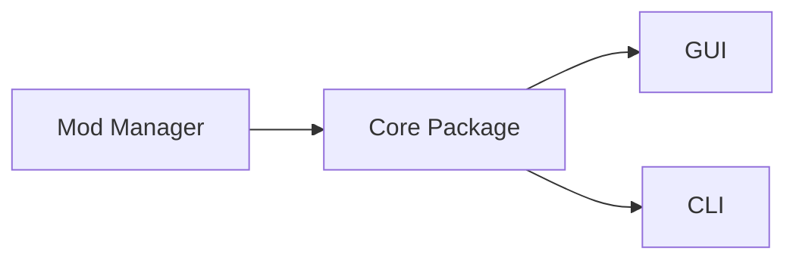
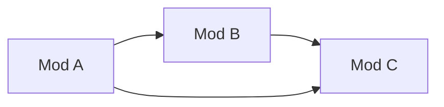

# Architecture

## Table of Contents

- [Architecture](#architecture)
  - [Table of Contents](#table-of-contents)
  - [Overview](#overview)
  - [Publishing](#publishing)
    - [Core](#core)
    - [CLI](#cli)
    - [GUI](#gui)
  - [Core Package](#core-package)
    - [Common Paths](#common-paths)
    - [Mod Installation Behavior](#mod-installation-behavior)
      - [Note about certain mods on Linux](#note-about-certain-mods-on-linux)
    - [Mod Uninstallation Behavior](#mod-uninstallation-behavior)
    - [Mod Enabling / Disabling Behavior](#mod-enabling--disabling-behavior)
      - [Note about recursive disabling](#note-about-recursive-disabling)
    - [Mod Updating / Version Checking Behavior](#mod-updating--version-checking-behavior)
      - [pathsToPreserve](#pathstopreserve)
    - [Mod Validation Behavior](#mod-validation-behavior)
    - [Mod Searching Behavior](#mod-searching-behavior)
      - [Formula](#formula)
    - [Launching Behavior](#launching-behavior)
    - [Log Server Behavior](#log-server-behavior)
    - [Alert Behavior](#alert-behavior)
    - [Analytics Behavior](#analytics-behavior)
    - [Progress Bar Behavior](#progress-bar-behavior)
      - [Throttling](#throttling)
  - [Protocol Behavior](#protocol-behavior)
    - [General Structure](#general-structure)
    - [Verbs](#verbs)
    - [Examples](#examples)
    - [Notes](#notes)
  - [GUI Package](#gui-package)
    - [State Management](#state-management)
    - [GUI OWML Setup Behavior](#gui-owml-setup-behavior)
    - [GUI Mod List Behavior](#gui-mod-list-behavior)
    - [DLC Mod Behavior](#dlc-mod-behavior)
    - [GUI Progress Bar Behavior](#gui-progress-bar-behavior)
    - [Busy Mod Behavior](#busy-mod-behavior)
    - [File System Behavior](#file-system-behavior)
    - [Recursive Enable Behavior](#recursive-enable-behavior)
    - [Translation Behavior](#translation-behavior)
    - [Theme Behavior](#theme-behavior)
    - [Logging Behavior](#logging-behavior)
    - [Error Handling](#error-handling)
    - [GUI Protocol Behavior](#gui-protocol-behavior)
    - [GUI Game Log Behavior](#gui-game-log-behavior)
    - [File Drop Behavior](#file-drop-behavior)
  - [CLI Package](#cli-package)
    - [CLI OWML Setup Behavior](#cli-owml-setup-behavior)
    - [CLI Recursion](#cli-recursion)
    - [CLI Logging Behavior](#cli-logging-behavior)
      - [Padding](#padding)
    - [CLI Progress Bar Behavior](#cli-progress-bar-behavior)

## Overview



The mod manager is split up into 3 main parts:

- The Core Package - This contains shared code between the GUI and CLI
- The CLI - This is the command line interface to the mod manager
- The GUI - This is the graphical user interface to the mod manager

There also is `xtask` which is used internally for simple scripts.

## Publishing

Versions of the manager are published to the following sources

### Core

- [crates.io](https://crates.io/crates/owmods_core)
- GitHub Releases
  - .crate

### CLI

- [crates.io](https://crates.io/crates/owmods_cli)
- GitHub Releases
  - .deb
  - .tar.gz
  - .exe
- [AUR](https://aur.archlinux.org/packages/owmods-cli-bin/)
- [NixOS flake](nix/)

### GUI

- GitHub releases
  - .deb
  - .rpm
  - .tar.gz
  - .AppImage
  - .msi (Wix)
  - .exe (NSIS)
- [AUR](https://aur.archlinux.org/packages/owmods-gui-bin/)
- [NixOS flake](nix/)
- [Flathub](https://flathub.org/apps/com.outerwildsmods.owmods_gui)

## Core Package

The core package contains shared code between the GUI and CLI.

It has a lot of stuff in it, basically, everything that isn't GUI or CLI specific.

### Common Paths

(All these are in terms of Linux paths, on windows just replace `~/.local/share` with `%APPDATA%`)

- `~/.local/share/ow-mod-man` - The mod manager's config directory
  - `./settings.json` - The mod manager's settings file for the core package
  - `./gui_settings.json` - The mod manager's settings file for the GUI
  - -- No cli settings file yet --
  - `./logs` - The mod manager's logs directory, each folder is a day, and each file is named by the time it was created
  - `./game_logs` - Game logs the mod manager has collected, each folder is a day, and each file is named by the time it was created
- `~/.local/share/OuterWildsModManager` - The path the manager uses for OWML, note this path is different to keep backward compatibility with the old mod manager
  - `./OWML` - The OWML directory, contains the OWML install, and `Mods` contains the mods
- `~/.local/share/com.bwc9876.owmods-gui` - tauri-plugin-window-state uses this to store the window state (size, position, etc) (GUI only)

### Mod Installation Behavior

- It can install mods from a zip file, a URL, or the mods database
- The mod manager only supports extracting zip files
- It can recursively install mod dependencies (from the database only), and will automatically handle circular dependencies
- When recursively installing, the manager attempts to "de-dup" installs, preventing a mod that's depended on by multiple mods from being installed more than once
- It doesn't simply extract a mod's zip, it recursively searches for the manifest file in the zip and only extracts that file's siblings and children
- OWML installs are handled specially, use downloads::download_and_install_owml to install OWML
- Analytics are sent when a mod is installed, installed as a dependency, or updated. Note this only happens with `downloads::install_mod_from_db`.
- If a mod uses the `pathsToPreserve` field in its manifest, the manager will not overwrite these paths when updating the mod
  - This list includes `config.json` and `save.json` implicitly.
  - Note this will still delete the files if the mod is uninstalled.
  - Both files and folders are supported, however, it should be noted this **is not a glob pattern**, internally the manager simply checks if each path starts with a path with `pathsToPreserve` as a prefix.
  - Also of note, the manager refuses to extract any files that are found in pathsToPreserve, so if you have a file in a pathToPreserve pattern, it will not be overwritten. This means the config.json inside the mod's zip will not be extracted if the mod is already installed.

#### Note about certain mods on Linux

I don't know why, and I don't know how, but the PowerShell `Compress-Archive` module will use backslashes in zip archives, going [directly against the spec](https://pkware.cachefly.net/webdocs/casestudies/APPNOTE.TXT).

> 4.4.17.1 The name of the file, with optional relative path. The path stored MUST NOT contain a drive or device letter, or a leading slash. All slashes MUST be forward slashes / as opposed to backwards slashes \ for compatibility with Amiga and UNIX file systems etc. If input came from standard input, there is no file name field.

I'm not supporting this, so if you're a mod author and you're reading this, please use a different zip library. If you're a user and you're reading this, please tell the mod author to use a different zip library. I understand some mod authors use the PowerShell command in GitHub actions, if you want to still automate this stuff I recommend `7z`, it comes pre-installed on the default Windows runner and doesn't completely break.

Also, there's a [prebuilt action](https://github.com/ow-mods/ow-mod-template/blob/main/templates/Outer-Wilds-Mod-Template/parent-stuff/.github/workflows/release.yml) now for making mod releases if you're interested.

### Mod Uninstallation Behavior

- Pretty simple, it removes the mod's directory.
- One note is the manager will show a warning if a mod uses a prepatcher, as the patcher most likely modified the game's files, and uninstalling the mod will not revert these changes. This message cannot be set and is hardcoded.

### Mod Enabling / Disabling Behavior

- The mod manager can enable and disable mods.
- This can be done recursively, and will automatically handle circular dependencies.
- If a mod that uses a prepatcher is disabled, the manager will show a warning as the patcher most likely modified the game's files, and disabling the mod will not revert these changes. This message cannot be set and is hardcoded.

#### Note about recursive disabling

\* If mods are configured like so (with the arrows representing depending on the other mod):



If you disable Mod A, then Mod B and Mod C will be disabled as well. However, if you disable Mod B, Mod C will not be disabled.
This means the manager is smart with recursive disables and will not disable mods that are still needed by other mods.

### Mod Updating / Version Checking Behavior

- The mod manager performs sanitization on mod versions. It will strip any `v`'s prepended to the version.
- The mod manager will try to use Semver to compare versions, however, if the version is not Semver compatible it will just do a string comparison.
- Updates are very simple internally, it just re-downloads the mod since the database only has the most recent download link.
- As mentioned prior, `pathsToPreserve` will not be overwritten when updating a mod.

#### pathsToPreserve

Note that the manager uses the `pathsToPreserve` field **on the installed mod** when updating, not the one in the database. This means if a mod updates its `pathsToPreserve` field, the manager may overwrite files that are specified in the new `pathsToPreserve` field.

### Mod Validation Behavior

- The mod manager can validate mods, this is used to check if a mod is outdated, missing dependencies, is just broken, etc.
- See [ModValidationError](https://docs.rs/owmods_core/latest/owmods_core/validate/enum.ModValidationError.html) for a list of all the errors.
- All validations **except for `ModValidationError::Outdated`** are done locally, this means the manager does not need to fetch the database to validate a mod.
- You need to explicitly tell the LocalDatabase to validate updates, see [LocalDatabase::validate_updates](https://docs.rs/owmods_core/latest/owmods_core/db/struct.LocalDatabase.html#method.validate_updates) for more info.
- Mod validation errors should cause the manager to show a warning to the user, however, this is not enforced and is up to the GUI/CLI to implement.

### Mod Searching Behavior

- The mod manager can search for mods in the local and remote databases.
- For the local database, it will search the mod's name, name in the remote DB, unique name, and author.
- For the remote database, it will search the mod's name, unique name, author, and description.
- Each field is weighted by 1 if it contains the query, and by 2 if it's an exact match.
- Each field the manager checks for search is weighted by its position in that list, so matches in the name take precedence over matches in the author for example.
- The score of each field is then added together to get the final score of the mod.
- All fields are normalized to increase the chances of matching, as well as the search query.
  - The field is lowercased
  - The field gets NFD normalized
  - The field gets all whitespace and control characters removed
  - The field gets any combining diacritical marks (`\u{0300}`-`\u{036f}`) removed
- The exact formula for determining the score is below

#### Formula

- let i = the field's index (0-based)
- let m = the fields match weight (1 or 2)

$$
score = (1 - (i / 10 * 2)) * m
$$

This is a weird way to do this and will probably be changed in the future.

### Launching Behavior

- The mod manager can launch the game, or more accurately launch OWML.
- When launching the game the manager can also start a log server, this is used to collect logs from the game. Note this will not happen implicitly, you'll need to make a new `LogServer` and call `listen` on it to listen to logs from the game. To make the two tasks happen at the same time use `tokio::join!`
- On Linux, the manager also performs special behavior that patches OWML to run properly under Mono
- If an error is detected in the mod configuration (missing dependencies, outdated mods, etc), the manager will show a warning to the user. This warning is a generic warning and cannot be set, and can be disabled in the settings. **Note it's up to the GUI/CLI to implement this behavior.**
- If a mod specifies a `warning` object in its manifest, the warning title and message will be the one specified in the manifest. This warning will only be shown once and on subsequent launches it will be suppressed. This is used to warn users about mods that are known to cause issues.
- **On Windows only**, the manager can also let OWML handle logs, meaning the manager will not collect logs from the game. This makes the manager simply open a cmd window and run the game. This behavior is disabled on Linux as there's no standard for launching a terminal emulator.
- If the `NO_GAME` env var is set to `TRUE` at compile time, the manager will not launch the game. This is useful for testing the GUI without having to launch the game.

### Log Server Behavior

- The mod manager can start a log server, this is used to collect logs from the game.
- The server uses TCP.
- The server can handle multiple connections at once.
- This server can bind to any port, but most of the time it uses 0 to get one from the OS.
- The server will listen for logs from the game and send them via an mpsc channel to consumers.
- Messages must be valid JSON and end with a newline character.
- See [SocketMessage](https://docs.rs/owmods_core/latest/owmods_core/socket/struct.SocketMessage.html) to see the format of the messages.
- The server may or may not stop listening when receiving the `Quit` message depending on the use-case (CLI it does, GUI it doesn't).
- The server may drop lines if the mpsc channel is full, this is to prevent the server from blocking the UI.

### Alert Behavior

- The mod manager can fetch alerts from the remote database.
- These alerts serve as ways to notify users of important information such as breaking changes or new features.
- By default alerts use [the one in the mod database repo](https://github.com/ow-mods/ow-mod-db/raw/source/alert-v2.json).
- The `-v2` is for the new mod manager, the old one uses no suffix.
- The manager automatically migrates the alert URL from the old one to the new one.
- To see all possible fields in an alert see [Alert](https://docs.rs/owmods_core/latest/owmods_core/alerts/struct.Alert.html).
- Note that URLs in alerts should only be allowed to open the mods website, the discord server (using invite <https://discord.gg/wusTQYbYTc>), or GitHub.

### Analytics Behavior

- The mod manager can send analytics events to the google analytics API.
- This is to help rank mods on the website and keep track of engagement
- **No personal information is sent**, only the mod unique name, the event name, and a unique ID generated for your session, this ID changes every time you open the manager.
- For a list of all events see [AnalyticsEventName](https://docs.rs/owmods_core/latest/owmods_core/analytics/enum.AnalyticsEventName.html)
- Events are sent with `install_mod_from_db` and `update_all`, other functions are up to the GUI/CLI to implement.
- If the `ANALYTICS_API_KEY` env var is empty at compile time, analytics will be disabled.

### Progress Bar Behavior

- The mod manager uses a progress bar to show progress when installing mods.
- The progress bars are sent over log lines, and it's up to the GUI/CLI to implement the progress bar.
- The following payloads exist for log lines:
  - Start
  - Increment
  - Message
  - Finish
- Each payload takes the ID for the progress bar and then additional args
- The ID is derived from the temp dir the mod is being installed to, this means if the mod is being installed to the same temp dir as another mod, the progress bar will be the same, but this is unlikely to happen.
- Payloads are put into logs as JSON with their target set to `progress`.
- When a progress bar is dropped (as in it's gone out of scope) without having `finish` called on it, the manager will mark it as failed.
- A progress bar can optionally have a mod's unique name associated with it, this is mainly used in modeless UI (i.e. the GUI) to mark a mod as "busy" and prevent other actions from being performed on it.
- Progress bars can be marked as indeterminate, this is used when the manager doesn't know how long the operation will take. This is mainly used for downloading mods from a URL where the server doesn't send a content-length header (e.g. GitHub actions artifacts).
- The length of the progress bar is determined by its type
  - Downloads will be the number of bytes downloaded (provided the server set a content-length header)
  - Extracts will be the number of files in the zip. Note this won't always match the number of files extracted, as the manager only extracts the files that are siblings and children of the manifest file. This quirk shouldn't happen too much though, and it's not a big deal if it does.
- Internally progress bars throttle their updates to prevent excessive UI updates.

#### Throttling

The manager will throttle progress bars on-increment. Essentially it keeps two values in mind, the _actual_ value of the bar and the value that was last reported to logs. If the difference between the two is larger than the total length of the bar divided by 30, an increment will be sent to logs. This tries to strike a balance between not updating the UI too much and not making the progress bar feel like it's stuck.

So if I had a progress bar that was a length of 90, and I increment by 1 every 1 second, the manager would only send an increment to logs every 3 seconds.

## Protocol Behavior

- The mod manager can install mods from a URL or a URI.
- The mod manager can also run the game from a URI.
- The manager uses the `owmods://` protocol.

### General Structure

`owmods://verb/payload`

All URLs should start with owmods://  
Then they should follow with the verb they want like `install-mod` or `install-url`  
Finally they should have the payload for the action

### Verbs

- `install-mod` - Installs a mod from the mods database, the payload should be the mod unique name
- `install-url` - Installs a mod from a url, the payload should be the url to install from, **Not URI encoded**
- `install-zip` - Installs a mod from a zip file, the payload should be the path to the zip file, note you shouldn't really need to use this because every user's computer is different, this is just used internally for drag and drop
- `install-prerelease` - Installs a mod from a prerelease (in the mods database), the payload should be the mod unique name
- `run-game` - Runs the game, the payload should be a unique name for the mod to enable before running the game

### Examples

- owmods://install-mod/Bwc9876.TimeSaver
- owmods://install-url/<https://example.com/Mod.zip>
- owmods://install-zip//home/user/Downloads/Mod.zip
- owmods://install-prerelease/Raicuparta.NomaiVR
- owmods://run-game/Bwc9876.TimeSaver

### Notes

- The payload should **NOT** be URI encoded, it should be just the raw payload
- In the case of `install-url` the url should be a direct download link, not a page with a download button
- In the future this might become more advanced and have query params and stuff. If this happens `install-prerelease` will be changed to `install-mod` with a query param, however this will be backwards compatible
- In the case of `run-game` The manager will enable (but not install) the mod before running the game. This is to prevent the user from having to enable the mod manually. This is most useful in development of mods as launch scripts can simply call `xdg-open owmods://run-game/My.Mod` to run the game with the mod enabled.
- Note that on Windows users have to open the mod manager at least once before this will work, this is because the protocol is registered when the mod manager is opened.
- All install types except `install-mod` will not automatically install the mod and require further user input for security reasons. `install-mod` pulls from the database which is trusted so it doesn't need to ask the user.

## GUI Package

The GUI has a lot of behavior specific to it as the CLI doesn't really need much.

### State Management

- The GUI stores most state on the backend and syncs it to the frontend through commands and events using the useTauri hook.
- All state is held in an `Arc<tokio::Rwlock>` to allow for multiple readers and one writer.
- The manager tries its best to prevent deadlocks, but it's not perfect.
- The frontend can't directly edit state, instead, it needs to use commands to dispatch actions that eventually edit the state

### GUI OWML Setup Behavior

- The GUI can install OWML for the user.
- OWML is required to run mods, so the GUI will prompt the user to install it if it's not installed, and won't let the user do anything else until it's installed.
- The user can also choose to locate an existing OWML install or use a prerelease of OWML.
- The user can also change the OWML install location in the settings or install/change it by clicking "Edit OWML Install" in the overflow menu

### GUI Mod List Behavior

- The GUI displays three lists of mods, the installed mods, the mods in the database, and outdated mods.
- The installed mods list shows all installed mods, and allows the user to enable/disable, update, and uninstall mods.
- The mods in the database list shows all mods in the database, and allows the user to install mods or their prereleases.
- Mod thumbnails are displayed in the mod list, and are loaded from the mods database as optimized webp images.
- The outdated mods list shows all installed mods that have an update available, and allows the user to update them all at once or one at a time.
- The updates tab will display a badge with the number of updates available.
- All lists are virtualized to prevent excessive DOM nodes from being created.
- It should be notes that switching tabs **does not unmount them** to prevent costly commits to the DOM. the reasoning behind this is because the lists are all virtualized they'll all have a height of 0 when not visible, so they won't render any rows, meaning little to no performance impact.

### DLC Mod Behavior

- The GUI will show an icon next to mods that require the DLC to be installed.
- The GUI also has an option for the user to hide DLC mods on the remote mods tab.s

### GUI Progress Bar Behavior

- The GUI uses a progress bar to show progress when installing mods.
- The progress bars are displayed both in the top left "Downloads" popover, and next to the mod in the mod list.
- The downloads button will change color depending on the current state of the downloads.
- The downloads button will show a badge with the number of downloads in progress if there are any.
- The downloads button will show a badge with the amount of completed downloads, and hide the number when you click the button.
- The downloads button will flash green when a download completes.
- The downloads button will flash red when a download fails.
- The downloads button will be the secondary color (orange by default) when a download is in progress
- In addition, an orange circle around the downloads button will show that fills up as the download progresses.
- The downloads button will be the default white otherwise

### Busy Mod Behavior

- When a mod has an action being performed on it, it will be marked as "busy" and the user will not be able to perform any actions on it.
- Actions include Installing, Updating, Fixing, etc. Essentially anything that deals with the file system
- Note that _fixing_ a mod is special, due to the nature of fixing dependencies we can't guarantee that other mods won't also have actions being performed on them, so we disable fixing all mods when at least one mod is busy.

### File System Behavior

- The GUI uses the notify crate to watch for changes in the file system.
- The GUI will watch the following paths:
  - `~/.local/share/ow-mod-man/{settings,gui_settings}.json`
  - `~/.local/share/OuterWildsModManager/OWML/Mods`
- Upon a change, the GUI will reload the settings and the mods database respectively.
- This behavior can be disabled in the settings.

### Recursive Enable Behavior

- The GUI can recursively enable mods through the core lib.
- However, by default this will prompt the user to confirm the action to lessen confusion.
- This behavior can be disabled in the settings, making it so the GUI will recursively enable mods without prompting the user.

### Translation Behavior

- The GUI translates most frontend strings.
- It does this with a JSON file for each language in `owmods_gui/frontend/src/assets/translations`.
- The JSON file is a map of the string ID to the translated string.
- The string ID is the key used in the `useGetTranslation` hook.
- Variables are denoted by dollar signs, for example, `Hello $name$!` will be translated to `Hello Bob!` if the variable `name` is `Bob`.
- As it stands no automatic detection of the user's language is implemented, so the user will have to manually change the language in the settings.

### Theme Behavior

- The GUI supports many themes
- The themes edit the primary and secondary values in the MUI theme object
- The themes' definitions are stored in `owmods_gui/backend/src/gui_config.rs` in the `Theme` enum.
- The actual colors are stored in `owmods_gui/frontend/src/theme.ts` in the `themeMap` object.
- The primary color is used for any CTA buttons, version chips, and completed downloads progress bars
- The secondary color is used for any in-progress downloads progress bars, the currently opened tab, and outdated mod version chips
- Rainbow mode is a special "theme" (although it's not actually a theme, just a checkbox) that places a rainbow gradient on various places where the primary would be displayed otherwise.

### Logging Behavior

- The GUI uses the log crate to log messages.
- The manager's logs are saved in `~/.local/share/ow-mod-man/logs`
- The initialization of the log system happens fairly early in the GUI's startup, so it's possible to miss some logs.
- Should a catastrophic error occur (the tauri builder fails), the manager will open a txt document with the fatal error, this txt document is saved in the manager's data folder with the date and time as the name, prefixed with "crash*log*".

### Error Handling

- The GUI uses the anyhow crate to handle errors.
- All commands that can fail return a Result, and the GUI will handle the error and show a dialog to the user, or be thrown to the nearest error bound
- Should an error occur in the frontend, it will be sent to the backend by the nearest error boundary and the backend will log it with the preface "Received error from frontend:"

### GUI Protocol Behavior

- The GUI uses the tauri-plugin-deep-link crate to handle the owmods protocol.
- The GUI will open the mod manager if it's not already open, and then install the mod.
- The GUI will prompt the user to confirm the install if the mod is from an unsafe source such as a URL or ZIP file
- The manager needs to be opened once before the protocol will work, this is because the protocol is registered when the manager is opened.

### GUI Game Log Behavior

- The GUI can collect logs from the game.
- The GUI will start a log server and listen for logs from the game.
- The GUI also timestamps the logs and displays sender type and timestamp in a tooltip when hovering over the sender name.
- The GUI can also search logs, it will search the sender name, sender type, and message.
- Logs are rendered in a separate window
- If the user chooses they can make each instance of the game open a new window, or they can have all instances of the game log to the same window.
- Internally the GUI throttles logs to prevent excessive UI updates, if >25 logs are received in a second the GUI will enqueue the logs and render them later.
- The frontend will display if logs are being throttled in the log window by turning the count amber and showing a warning icon.
- The GUI will never drop logs, however, the core library may drop logs if the mpsc channel is full.
- The GUI will virtualize the log list to prevent excessive DOM nodes from being created.

### File Drop Behavior

- The GUI can accept file drops from the OS.
- The GUI will check if the file is a zip, and if it is it will open the Install From Zip dialog.

## CLI Package

The CLI is pretty simple, it just parses arguments using clap and calls functions in the core package. It has the same features as the GUI, except for protocols and file drops. It also utilizes a few features that the GUI doesn't, such as recursive disabling.

### CLI OWML Setup Behavior

- The CLI can install OWML for the user.
- OWML is required to run mods, so the CLI will prompt the user to install it if it's not installed, and won't let the user do anything else until it's installed.
- All commands besides `setup`, `version`, `help`, and a few others will prompt the user to install OWML if it's not installed.
- The user can also choose to locate an existing OWML install by passing a path to `owmods setup`
- The user can use the `--prerelease` flag to install a prerelease of OWML.

### CLI Recursion

- The CLI can optionally perform actions recursively using the `--recursive` flag.

### CLI Logging Behavior

- The CLI uses the log crate to log messages.
- It prints logs to the terminal but doesn't save them anywhere.
- Debug logs are disabled by default, but can be enabled with the `--debug` flag. **This means that even if OWML's debug mode is enabled, the CLI will not print debug logs unless the flag is passed.**
- Logs from the game are formatted to be more readable by padding with spaces, this can help make multiline logs like stack traces more readable
- The CLI also has strange behavior when starting the game via Steam, as Steam doesn't return an exit code of 0, the CLI has no choice but to say "Potentially failed to launch game" and dump the stdout and stderr of the game to the terminal. This is to prevent the loss of potentially useful information in the event the game actually _does_ fail to launch.

#### Padding

```log
[Manager::Example][INFO] Game Log!
Second Line!
```

Becomes...

```log
[Manager::Example][INFO] Game Log!
                         Second Line!
```

### CLI Progress Bar Behavior

- The CLI uses a progress bar to show progress when installing mods.
- The progress bars are displayed in the terminal using the indicatif crate.
- During parallel mod installs, multiple are shown, downloads are at the top, and extracts are at the bottom.
